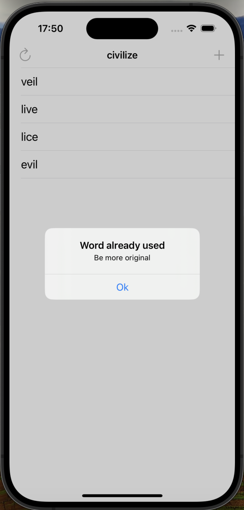

# Project5

Project5 is a simple word game that lets users invent words out of the main word`s letters.

## Table of Contents

* [Features](#features)
* [Screenshots](#screenshots)
* [Requirements](#requirements)
* [Code Overview](#code-overview)

## Features

* Start a new game with a random word
* Submit answers and see if they are correct
* See the list of submitted words

## Screenshots

  
   
  <em>Start Game Screen</em>

  
   
  <em>Used Words List</em>

  
   
  <em>Error Message</em>

## Requirements

* iOS 12.0+
* Xcode 12.0+
* Swift 5.0+

## Code Overview

### ViewController

* Manages the list of submitted words and displays them in a table view.
* Handles user interactions, such as submitting answers and showing error messages.
* Includes a feature to start a new game with a random word.
